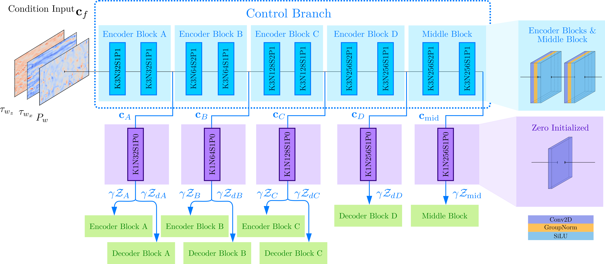
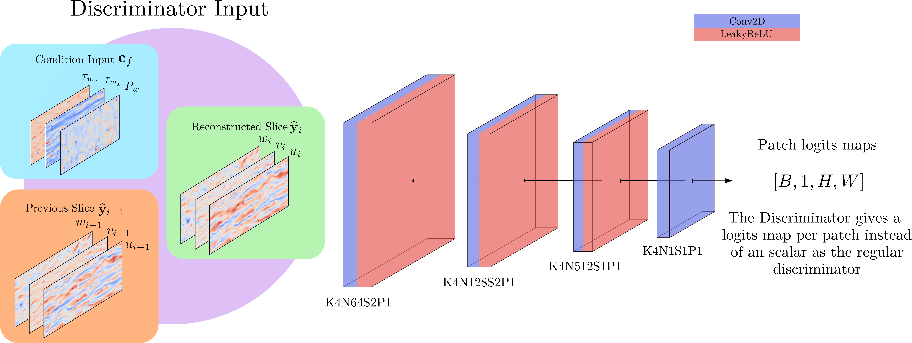

# 3D Reconstruction of Turbulence From Wall Data Using a Physics Guided Motion-Transformer Framework

This repository implements a physics-guided deep generative framework for the real-time reconstruction of three-dimensional turbulent channel flows from wall measurements.
The method is motivated by the fact that, in many aerodynamic and industrial applications, only wall-based quantities such as pressure and shear stresses are accessible in real time. The proposed architecture uses these sparse surface measurements to reconstruct the full volumetric velocity field inside the flow domain.
The core idea is to reinterpret the wall-normal direction as a pseudo-temporal axis. In this way, the reconstruction problem is formulated as an image-to-video generation task, where each wall-parallel flow slice is generated sequentially from the wall towards the channel center.
The architecture is composed of different main components:

The proposed framework reconstructs a three-dimensional turbulent velocity field from wall-based measurements. The input consists of instantaneous wall pressure and wall-shear-stress fields,

$$
\mathbf{c}_f = (p_w, \tau_{w_x}, \tau_{w_z}),
$$

which are arranged as a multi-channel 2D image. The model then generates the 3D flow field slice by slice along the wall-normal direction. This direction is interpreted as a pseudo-temporal axis, allowing the use of image-to-video ideas to promote coherence between consecutive wall-parallel slices.

  

### Global Network

The global architecture combines a slice-wise U-Net generator, a ControlNet-style conditioning branch, and an AnimateDiff-inspired Motion Transformer. The generation process starts from a prescribed zero-valued wall slice, consistent with the no-slip and no-penetration boundary conditions. Then, each wall-parallel velocity slice

$$
\hat{\mathbf{y}}_t = (\hat{u}_t, \hat{v}_t, \hat{w}_t)
$$

is predicted from the previous slice and the wall-conditioning information. The final 3D reconstruction is obtained by stacking all predicted slices along the wall-normal direction.

---

## Main Components

### 1. Control Branch

The Control Branch encodes the wall information, namely wall pressure and the two wall-shear-stress components. These inputs are processed through convolutional blocks to extract multi-scale conditioning features. The resulting feature maps are injected into the U-Net generator at different encoder, bottleneck, and decoder stages through zero-initialized adapters.

This module allows the wall measurements to guide the reconstruction process while keeping the generative backbone stable during training.

  

---

### 2. Slice-Conditional U-Net Generator

The U-Net is the main slice-wise generator. It receives the previous predicted slice and produces the next wall-parallel velocity slice. The encoder progressively compresses the spatial representation, while the decoder reconstructs the output resolution using skip connections to preserve spatial detail.

Control features from the Control Branch are injected throughout the U-Net, so the generation of each slice remains conditioned on the wall measurements.

  

---

### 3. Motion Transformer

The Motion Transformer is inspired by AnimateDiff and is used to improve coherence between consecutive wall-normal slices. It operates at the U-Net bottleneck, where mid-level feature maps from a window of consecutive slices are stacked along the pseudo-temporal direction.

Self-attention is then applied along the slice index, allowing the model to learn how flow structures evolve from the wall into the channel. The transformer output is added as a residual correction to the bottleneck features before decoding.

  

---

### 4. PatchGAN Discriminator

A conditional PatchGAN discriminator is used during training to improve the local realism of the generated slices. For each predicted slice, the discriminator receives a concatenation of the current slice, the wall measurements, and the previous slice. It outputs a spatial map of real/fake logits, encouraging the generator to produce locally realistic turbulent structures.

If the discriminator scheme is available as an image, it can be added as:

  

---

## Training Strategy

The model is trained using a combination of data-driven, adversarial, and physics-guided losses. The data loss enforces agreement with the reference DNS velocity fields, while the adversarial loss improves local realism. Additional physics-based constraints are included to promote mass conservation, partial momentum consistency, and periodicity at the side boundaries of the reconstructed volume.

Overall, the framework combines wall-conditioned generation, cross-slice coherence, and physics-guided training to obtain fast and physically consistent 3D turbulent-flow reconstructions from wall measurements.

